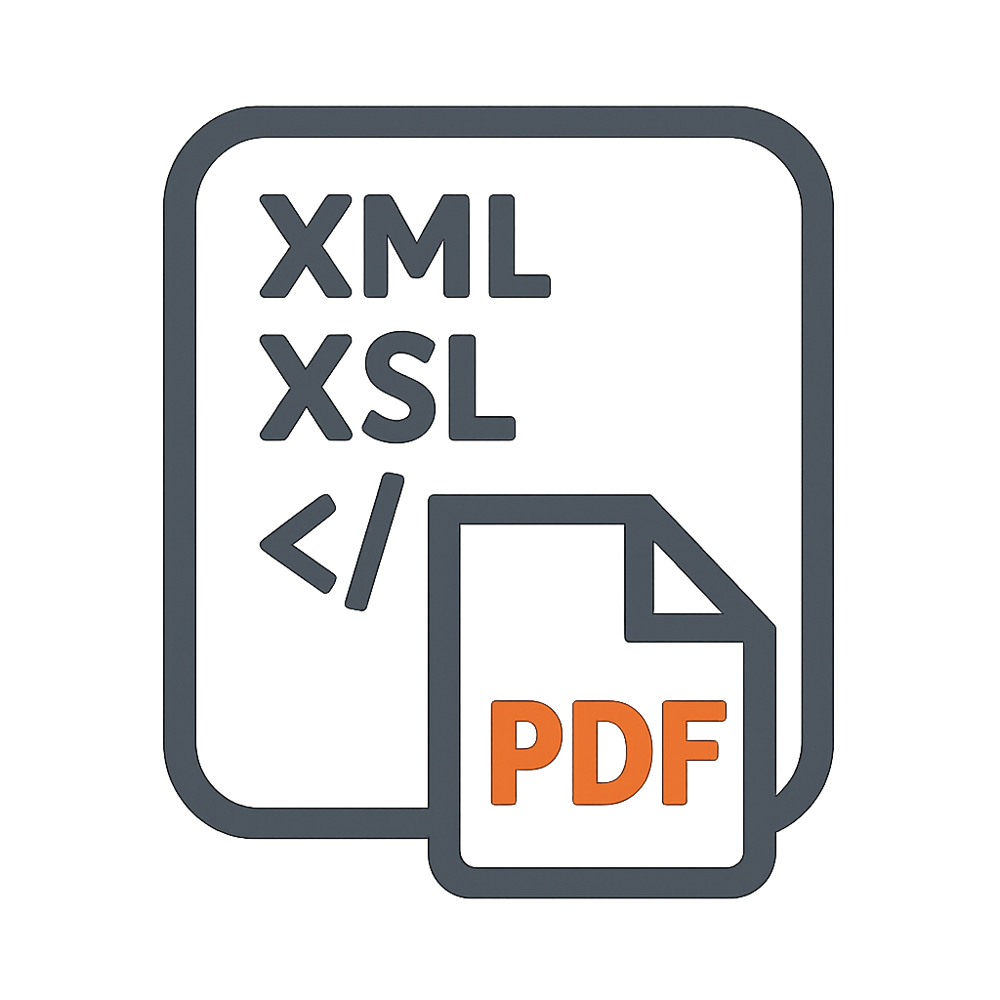
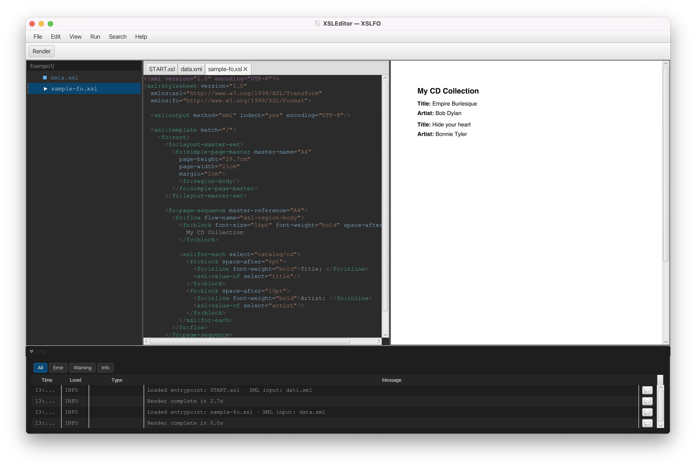

# XSLEditor

> Local desktop tool for developers to edit multi-file XSLT/XSL-FO templates, generate PDFs on demand, and debug the full pipeline — all in one window.



**Version:** 0.3.0

## Overview

XSLEditor implements the complete XML → XSLT → XSL-FO → PDF pipeline in a single desktop application. There is no external backend, no network dependency, and no authentication — everything runs locally on the developer's machine.

Core goals:
- Edit-to-preview cycle under 5 seconds
- No context switching: file tree, code editor, and PDF preview in one window
- Real-time XML validation with error navigation (click error → jump to source line)
- Multi-file project support with dependency tracking
- Full pipeline error reporting: XML syntax, XSLT compile, XSLT runtime, XSL-FO rendering

## Screenshot



*Three-panel layout: file tree (left), code editor (center), PDF preview (right)*

## Prerequisites

- **Java 21** or later — [Download from Adoptium](https://adoptium.net/)
- No other runtime dependencies: Saxon, FOP, JavaFX, and all libraries are bundled in the shadow JAR.

## Build

```bash
./gradlew shadowJar
```

Output: `build/libs/XSLEditor-0.3.0.jar`

## Run

```bash
java -jar build/libs/XSLEditor-0.3.0.jar
```

macOS note: if you see a Gatekeeper warning, right-click the JAR and choose Open, or run:

```bash
xattr -d com.apple.quarantine build/libs/XSLEditor-0.3.0.jar
```

## Tech Stack

| Component | Library / Version |
|-----------|-------------------|
| Language | Java 21 |
| UI framework | JavaFX 21 (controls, fxml, web) |
| Code editor widget | RichTextFX 0.11.5 |
| XSLT processor | Saxon-HE 12.4 |
| XSL-FO → PDF renderer | Apache FOP 2.9 |
| PDF page rendering | Apache PDFBox 2.0.31 |
| Project config (JSON) | Jackson Databind 2.17.2 |
| Build & packaging | Gradle 9 + Shadow JAR |

## Project Structure

```
src/main/java/ch/ti/gagi/xsleditor/
  XSLEditorApp.java          — JavaFX Application entry point
  controller/                — FXML controllers (editor, preview, log panel)
  model/                     — Project model, file management
  render/                    — XSLT + FOP pipeline orchestration
  util/                      — Encoding detection, preprocessing directives
src/main/resources/
  ch/ti/gagi/xsleditor/
    *.fxml                   — Layout files
    dark-theme.css           — Application stylesheet
    icon.png                 — Application icon
    version.properties       — Version string injected at build time
```

## Development Notes

- Build system: Gradle 9 with the `com.gradleup.shadow` plugin (gradleup fork — required for Gradle 9 compatibility)
- All pipeline stages run in-process; no subprocess spawning
- Project files are stored as `.xsle-tool.json` alongside the project's XSLT files
- Custom preprocessing directives (`<?LIBRARY ...?>`) are resolved before the XSLT pipeline runs

## Contributing / Release Setup

To configure macOS signing and notarization secrets for CI releases, see [`docs/SIGNING.md`](docs/SIGNING.md).

## License

Internal developer tool — not distributed publicly.
